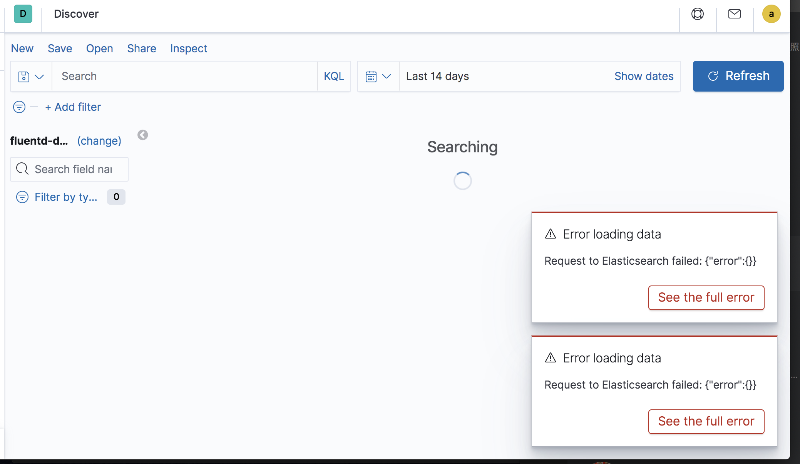
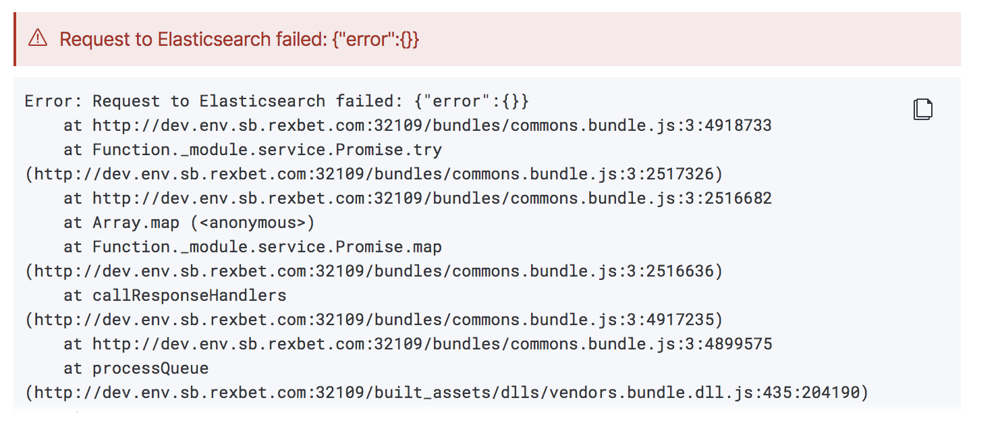
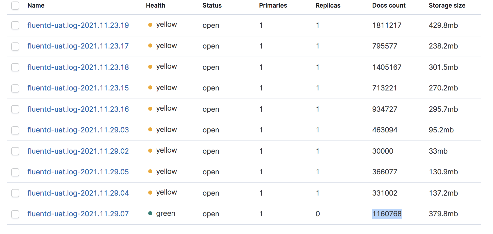
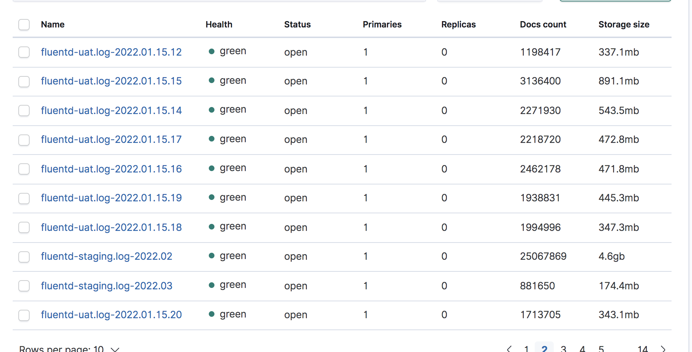
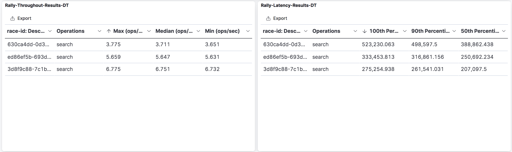
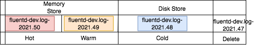
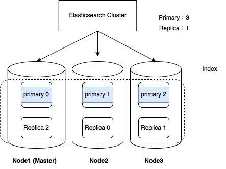

# Elasticsearch Cluster Optimize
###Root Cause 
- 在沒有搜尋條件下，查詢長天數過慢，導致crash




###Soluction

經過測試，此為kibana query elasticsearch的timeout
延長timeout時間可以解決crash問題

設定 /etc/kibana/kibana.yml (default 30秒)

`elasticsearch.requestTimeout: 30000`

##查詢優化 - 減少 Search 時間

#### 第一階段 Disable Replica Shard
因為目前elasticsearch Cluster 是單一台node，無法做replica 備援。
elasticsearch 原始Default設定是一個index，有兩個shard (一個primary shard，一個replica shard )，會造成資源浪費，故可以設定 Index template ，關掉備份 replica 的機制。

- 設定Index Template：
```
curl -X PUT -H "Content-Type: application/json" -d '{
    "index_patterns": ["*"],
      "settings": {
        "number_of_shards": 1,
        "number_of_replicas": "0"
      }
    }' "http://IP:9200/_template/template_1"
```

有兩個shard的狀況，Index會呈現橘色（Unhealth）的狀態：
   

設定Index Template，一個Index一個shard，會呈現綠色（health）的狀態：
   
- 結論：
    若是單一台Node來做elasticsearch 服務的話，關掉Replica shard的備份機制，能夠減少資源上的浪費。但若是以兩台node以上的elasticsearch cluster 還是需開啟reploca shard的備份機制。不只能夠過災難備援，也能增加查詢效能。
#### 第二階段 調整Index大小
目前elasticsearch的資料是以time-series data的架構來做Index的切分，以小時單位來做切分的話，每小時會重新create一個Index依序建立(例如fluentd-dev-2022-01.01.01、fluentd-dev-2022-01.01.02、 ...fluentd-dev-2022-01.01.24 )，一天會有24個Index數量，Shard的數量也就是24個（一個Index分配一個Shard）。
#####測試方法：
以單一台elasticsearch測試**一週**的資料量（約**45G**），透過修改index間隔時間，測試每種搜尋效能

- 以小時切分index做區間間隔：一週會有7(day)*24(hour)=**168**個index
- 以每天切分index做區間間隔：一週會有7(day)=**7**個index
- 以一週切分index做區間間隔：一週會有**1**個index
  
|  Index Pattern        | Period | Index Number |Per Index Size|Total Index Size |
|-----------------------|--------|--------------|--------------|-----------------|
| fluentd-hour-*        | 1 hour |   168        |274MB         |45G              |
| fluentd-day-*         | 1 day  |   7          |6.4G          |45G              |
| fluentd-week-*        | 1 week |   1          |45G           |45G              |

##### 測試結果

透過`esrally` 壓力測試同樣Size、同樣數量的Documents，三種不同ㄛndex Pattern。設定Operation為`Search` 搜尋當前Index Pattern 底下所有index，匯出benchmark dashboard來觀察

   

整理表格
| Index-Pattern                 |Operations|Max (ops/sec)|Median (ops/sec)|Min (ops/sec)|
|------------------------------------|----------|-------------|----------------|-------------|
|fluentd-hour*|search    |3.775        |3.711           |3.651        |
|fluentd-day* |search    |5.659        |5.647           |5.631        |
|fluentd-week*|search    |6.775        |6.751           |6.732        |

| Index-Pattern                 |Operations|100th Percentile (ms)|90th Percentile (ms)|50th Percentile (ms)|
|------------------------------------|----------|---------------------|--------------------|--------------------|
|fluentd-hour*|search    |523,230.063          |498,597.5           |388,862.438         |
|fluentd-day*|search    |333,453.813          |316,861.156         |250,692.234         |
|fluentd-week*|search    |275,254.938          |261,541.031         |207,097.5           |


- 結論：
 1. 以目前單一台Node，45G的量來測試，越少數量的Index搜尋效能會越好。Search 在執行時，一個 Shard 會分配一個 Thread，數量太多反而會拖慢速度。

---


#### 第三階段 設定Index Lifecycle

- 調整範圍 : 
  1. 移除 cronjob定期刪除index的job，改用透過ElasticSerach的 Index Lifecycle Management，刪除過期的index
  2. 所有環境的Index，調整為保留3週的log。
    

 Index Lifecycle Management 主要的 4 個階段

   
   以週期切割Index做Lifecycle 的rollover階段（滾動4個階段）
* Hot: 通常是用來放最新的資料。 可以寫入、可以查詢，故把**第一週的Index放在Hot Phase** ，在Memory Store 增加查詢效能。
* Warm: 資料進來後，不再寫入時，但還是會常常的查用，通常會放在這個階段。故把**第二週的Index放Warm Phase**。
* Cold: 資料已放蠻久的，不常使用到，但還是希望需要用到時能馬上就能用，但願意接受速度較慢一些，就會放在這個階段。故把**第三週的index放在Cold Phase**。
* Delete: 替代用script的方式刪除index。**第四週的資料可以透過lifecycle刪除**。
  參考：[hot warn cold in elasticsearch](https://www.elastic.co/blog/implementing-hot-warm-cold-in-elasticsearch-with-index-lifecycle-management)


#### 第四階段 設定3台Node 做cluster

   

1. 設定一個index有3個primary shard,分佈在三台node上,分散loading
2. 設定每一個primary shard 有一個replica shard,也就是一個index有3個replica shard，設定replica shard可以提昇效能


#### 問題

1. Ｑ: 若修改Index區間，如何解決 Uat 每小時倒index回來的問題？
   A: 透過elasticdump，輸入時用week 輸入內網環境
2. Ｑ: 因有倒回index需求，uat環境index不一致，如何解決刪除index問題？
   A: 透過Index Life Cycle，設定過期時間，自動刪除(每個環境的Index Life Cycle 設定一致)


# elasticsearch-cluster
